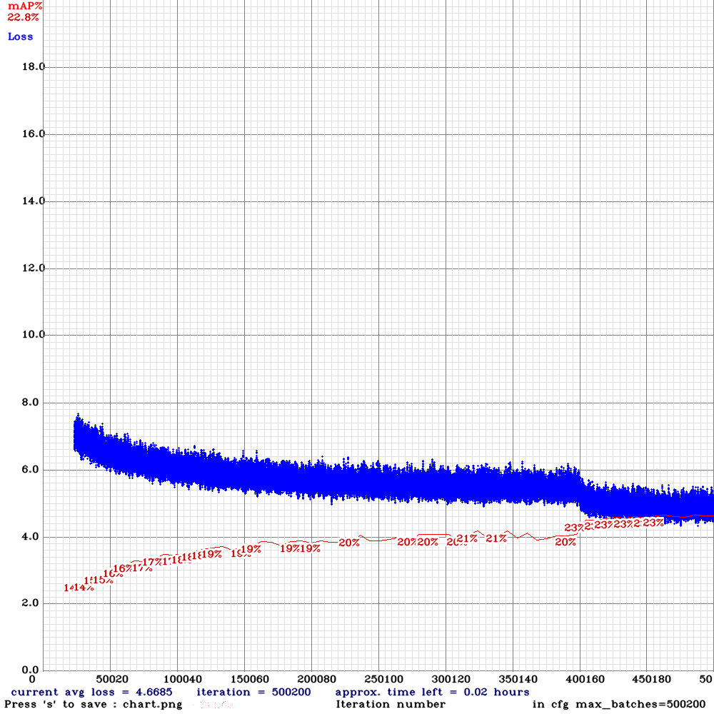

# MECo Custom Model Train and Deploy
  The following is a tutorial covering the training and deployment of two customized models for Metropolis on the VCK190. The models are as follows:

  - Customized Resnet (Resnet-21), trained on ImageNet using Tensorflow 1.14 with TF Estimators
  - Customized tiny-yolov2, trained on COCO 2014 with Darknet

  This tutorial is based on the EA2 release of the VCK190 board image and MECo tools for quantizing and compiling the model.  

  For internal Xilinx users. the repo can be found here: https://gitenterprise.xilinx.com/metropolis/aie-ml-stack

  For external users, the official EA2 release is available here: https://github.com/Xilinx/aie-ml-stack, though users will need to
  contact Kamran Khan (kamrank@xilinx.com) with the user's github ID so they can be added to the private repository.

  In the initial EA2 release, the Metropolis engine implements 14 AI Engines for CNN inference and supports 3x models:
-  Inception-v1: original source -> https://github.com/tensorflow/models/tree/master/research/slim#pre-trained-models
-  ResNet-50 v1.5: original source-> https://github.com/tensorflow/models/blob/master/official/r1/resnet/resnet_model.py
-  tiny yolo v2: original source converted from darknet to TF -> https://github.com/jinyu121/DW2TF

  The organization of the tutorial is as follows:

  1. Environment Setup
  2. Dataset Preparation
  3. Resnet Model Preparation, Training, and Conversion
  4. Tiny Yolov2 Model Preparation, Training, and Conversion
  5. Model Quantization and Compilation
  6. Model Hardware Testing on the VCK190

  This tutorial was tested on my Ubuntu 16.04 workstation with a Xeon CPU, 64GB DDR4 memory, and 2x GTX 1080ti graphics cards for model training.  The software libraries used for NVidia were CUDA 10.0 and the latest CuDNN for CUDA 10.0.  Other software dependencies are installed as part of the anaconda virtual environment.

  If you're not interested in steps 2-4, you can simply skip down to step 5 and use the pretrained models I've provided under pre-trained_models/resnet_21 and pre-trained_models/tinyolov2_custom, and if you just want to skip down to testing the models on hardware, you can use the models under the pre-compiled_models directory.

## 1. Environment Setup
  The first step in preparing the environment to train the models is to install the tensorflow 1.14 tools.  For this purpose, I use Anaconda.  The Anaconda package can be installed as follows:

  ```
  wget https://repo.anaconda.com/archive/Anaconda3-2019.03-Linux-x86_64.sh
  bash ./Anaconda3-2019.03-Linux-x86_64.sh
  ```
  Once installed, a virtual environment can be created using the provided scripts under the [ref_files/conda](ref_files/conda) directory.  These scripts are intended to make it easy to set up the model training environment and will install tensorflow-gpu 1.14 as well as some other packages.  Note that you'll need to install CUDA 10.0 and CuDNN separately and you can use your favorite search engine to figure out how to do this if you haven't done it before.

  To set up and enable the virtual environment with GPU enabled, run the following commands:

  ```
  ./conda/setup.sh
  conda activate tf1.14-gpu
  ```

  If you don't have a GPU, you can change the pip_requirements.txt to change tensorflow-gpu==1.14 to tensorflow==1.14.  The conda environment will still be called tf1.14-gpu unless you change the name in setup.sh, but changing the tf distribution should remove the requirement for a GPU.

  The Metropolis tools can be cloned from the following repository, though you will need to request access from Kamran Khan (kamrank@xilinx.com) and provide him with your github user ID as it is a private repository.  Once you have received access, you can clone it via the following command:

  ```
  git clone https://github.com/Xilinx/aie-ml-stack.git
  ```

  ***Once you have the repository, follow the instructions in the ai-ml-stack readme to install the docker image and download the models.  Then test the flow for compiling one of the provided models to ensure things are working properly.  You should also follow the steps under the VCK190 setup to configure your VCK190 board and test the pre-built board image and jupyter notebooks.***

  A few notes about the MECo tools are as follows:

  The '-c' argument specifies the number of AIE cores to target for Metropolis (in this case, 14) and the -s argument specifies to use static mode.  You can find and explanation of the Retrain or Static mode in the public graffitist distribution: https://github.com/Xilinx/graffitist.

  This distribution also lists the supported ops and layer topologies which are important to note if you are hoping to deploy a custom model.  I've included the list below for convenience:

    Supported ops:
    compute: Conv2D, MatMul, DepthwiseConv2dNative
    normalization: FusedBatchNorm
    activation: Relu, Relu6, LeakyRelu, Maximum (for leaky-relu)
    scale preserving: ConcatV2, BiasAdd, Add (eltwise-add), Maximum (for leaky-relu)
    pool: MaxPool, AvgPool, Mean
    classifier: Softmax

    Supported layer topologies:
    compute -> normalization/bias-add
    compute -> normalization/bias-add -> activation
    compute -> normalization/bias-add -> eltwise-add
    compute -> normalization/bias-add -> eltwise-add -> activation (relu/relu6)

  Some other notable limitations in the current Metropolis release are:
  1. The EA2 release doesn't support spills/fills to DDR, so models that won't fit in on chip memory can't be executed in hardware until this feature has been added
  2. DepthwiseConv2dNative is supported in the MECo tools above, but isn't yet supported in the Metropolis engine in hardware, so while the model can be compiled if it contains this op type, it won't yet run in hardware.
  3. The Upsample layer isn't supported yet, so tiny-yolov3, segmentation models, and any other model that uses this layer won't be supportable out of the box until this layer has been added.

## 2. Dataset Preparation
 2.a) Imagenet Dataset Preparation
  The first model to be trained is a customized flavor of Resnet that I'll call Resnet-21 (since it ends up having 21 Conv2D layers).  The model is to be trained on Imagenet.  An academic torrent can be used to download Imagenet since direct downloads aren't supported any longer (note that you'll need a couple hundred gig of free disk space to do this).  

  A few examples of such torrents are:
  https://academictorrents.com/collection/imagenet-2012
  https://academictorrents.com/collection/imagenet
  http://academictorrents.com/details/564a77c1e1119da199ff32622a1609431b9f1c47

  Once the data has been downloaded, it needs to be prepared into TF Records for training/validation.  In order to prepare the dataset, I used a script called "imagenet_to_gcs.py" provided here:

  https://github.com/tensorflow/tpu/tree/master/tools/datasets

  I used Python3.5 and tensorflow 1.14 from the Conda environment for this process.  I also installed gcloud and google-cloud-storage even though the gcs feature isn't used, the script will fail if the module isn't available.

  ```
  pip install gcloud google-cloud-storage
  ```
  This preparatory script was written for python 2.7 and I'm guessing a specific version of tensorflow (who knows which as there was no documentation).  Because of this there were quite a few incompatibilities that needed to be resolved due to deltas between python 2.7 and python 3.5.

  Here are the changes I made to imagenet_to_gcs.py:
  ```
  line 172: colorspace = 'RGB'.encode()
  line 174: image_format = 'JPEG'.encode()
  line 187: 'image/class/synset': _bytes_feature(synset.encode()),
  line 189: 'image/filename': _bytes_feature(os.path.basename(filename.encode())),
  line 282:   with tf.gfile.FastGFile(filename, 'rb') as f:
  line 357:     random.shuffle(list(order))
  ```

  I then ran the script with the following arguments to create the tf records for training and validation.

  python imagenet_to_gcs.py \
    --raw_data_dir=$IMAGENET_HOME \
    --local_scratch_dir=$IMAGENET_HOME/tf_records \
    --nogcs_upload

  In case you're wondering the IMAGENET_HOME directory needs to contain the following before running this script:
  - train folder with 1000 subfolders (one for each class), each containing training images for that class
  - validation folder containing the 50000 validation images
  - synset_labels.txt - containing the labels for each of the validation images

  After this I was able to run the script with python 3.5 and process the dataset into tf_records

  The model training process expects all the tf records to be in one directory, so I did this by doing the following:

  ```
  mkdir $IMAGENET_HOME/tf_records/train_val
  mv $IMAGENET_HOME/tf_records/train/* $IMAGENET_HOME/tf_records/train_val
  mv $IMAGENET_HOME/tf_records/val/* $IMAGENET_HOME/tf_records//train_val
  ```

  2.b) If you are training the Tiny yolov2 model on Darknet, Joseph Redmon initially created some nice scripts to prep the Coco dataset, though I use the new and improved fork of Darknet from AlexeyAB.    

  Simply install the Darknet framework from [AlexeyAB's Darknet fork](https://githumb.com/AlexayAB/darknet) and use preparatory scripts to download the data:

  ```
  cp scripts/get_coco_dataset.sh data
  cd data
  bash get_coco_dataset.sh
  ```
  Note that you can change the location of where the dataset gets installed by just copying the script to where you want the data to be located before running it.  Note that this process will take about 24 hours depending on your connection speed and will require a couple hundred GB of disk space.

## 3.  Resnet Model Preparation, Training, and Conversion
Note that the following steps are done with the conda environment for tf1.14 active:

```
conda activate tf1.14-gpu
```

The model source as mentioned initially for Resnet in TensorFlow is https://github.com/tensorflow/models/blob/master/official/r1/resnet/resnet_model.py.  That said, this master repository is currently on the Tensorflow 2.2.0 release.  Because my Conda environment is TF 1.14 (because that is the version MECo uses) I ran into compatibility issues.

To circumvent these issues, I use the v1.11 tag for the resnet model:
https://github.com/tensorflow/models/releases/tag/v1.11

After downloading and extracting this repository issue the following command to get to the directory of interest for resnet:

```
cd official/resnet
```

You will also need to export the PYTHONPATH variable to point to this repository so that the various models can be found by the python scripts.

```
export PYTHONPATH=$PYTHONPATH:/path/to/models-1.11
```

I also ran the following to update the conda environment for any missing python packages:

```
pip install --user -r official/requirements.txt
```

At this point, if you run the model training for one of the resnet models using the readme provided with the git repository, there will be a couple issues:

Issue 1: The default setting for the training scripts will cause the model to be resnetv2 architecture which isn't supported by the MECo tools.  The issue is highlighted in the following diagram:

 

Issue 2: The default setting for the training scripts will also cause the model to be trained in channels first mode instead of channels last (if using a GPU).  MECo currently only supports channels last.  It's pretty easy to fix this issue by exporting the model as channels last which is what I do in the following steps.

The main script for training the models is official/resnet/imagenet_main.py.  If you explore this scripts, you should find the following functionality as part of the default flow:

In imagenet_main.py:
  1 define flags
  2 launch the main app that calls run_imagenet
  3 run_imagenet defines the input function (defined in the imagenet_main.py)

In resnet_run_loop.py:
  4 call resnet_run_loop.resnet_main and pass in flags, model fucntion, input function
    dataset name, and input shape
  5 within the model directory, delete the models if the clean flag is applied
  6 create a session_config based on values of inter_op_parallelism_threads
  7 Create a distribution_strategy based on the number of gpus from the args
  8 create a run_config from these two configs
  9 check to see if there's a pretrained model checkpoint path and warm
    start if there is (ommitting the dense layer)
  10 define the classifier using tf.estimator
  11 define the run_params
  12 set up a benchmark logger
  13 set up tf hooks for training
  14 define the input functions for train and eval
  15 check the eval_only flag and decide to perform a single loop if eval_only is set
     otherwise compute the number of times to loop while training which depends
     on train_epochs and epoches_between_evals
  16 loop through and call classifier.train
  17 evaluate the classifier and log the results

By default, the imagenet_main.py supports only fixed resnet model types of the following sizes: 18, 34, 50, 101, 512, 200.  

In order to try a more customized version, I added a resnet 21 size by making the following modifications on line 324 and 270 to include a '21' layer resnet:

```
def define_imagenet_flags():
  resnet_run_loop.define_resnet_flags(
      resnet_size_choices=['18', '21','34', '50', '101', '152', '200'])
  flags.adopt_module_key_flags(resnet_run_loop)
  flags_core.set_defaults(train_epochs=100)
```

```
  choices = {
      18: [2, 2, 2, 2],
      21: [2, 3, 3, 2],
      34: [3, 4, 6, 3],
      50: [3, 4, 6, 3],
      101: [3, 4, 23, 3],
      152: [3, 8, 36, 3],
      200: [3, 24, 36, 3]
  }
```

I've included a [training script](ref_files/train_resnet_21.sh) which can be used to train the model on Imagenet, though after exporting the PYTHONPATH and changing to the resnet directory, you should be able to enter something like the following to train the new resnet-21 model (modify the dataset path and GPUs for your environment):

```
python imagenet_main.py --data_dir=path/to/IMAGENET_HOME/tf_records/train_val/ --num_gpus=2 --resnet_size=21 --resnet_version=1 --model_dir=./resnet_21 2<&1 | tee train_resnet21.log
```

By default the training will run for 100 epochs as well and I've included a [training log](ref_files/train_resnet21.log) which shows the results of the training process.  The end accuracy of the model is 87.5% for Top-5 and 65.5% for Top-1.  Training took about 3 days on my hardware.

After training, the model checkpoints will have a bunch nodes in them which aren't compatible with MECo, so it is necessary to export the model using the imagenet_main.py script.  The following command can be used to create a saved model format under the resnet_21/export_model directory:

```
python imagenet_main.py --data_dir==path/to/ImageNet/IMAGENET_HOME/tf_records/train_val/ --num_gpus=2 --data_format=channels_last --resnet_size=21 --resnet_version=1 --model_dir=./resnet_21 --eval_only --export_dir=./resnet_21/export_model 2<&1 | tee export_resnet21.log
```

I've included a [log file](ref_files/export_resnet21.log) that shows the console output for this command as it was run in my environment.

The saved model will also still have nodes in it that aren't compatible with MECo, so there is one more conversion script that I've provided which will read the latest saved model in, get the main graph, and save is as a serialized string in a single .pb file.

The script is [ref_files/convert_for_MECo.py](ref_files/convert_for_MECo.py).  In order to do this final conversion step, simply copy the script into the models-1.11/official/resnet folder and run the following from the command line:

```
python convert_for_MECo.py
```

The result of this process should produce a frozen model called resnet_21_pretrained.pb in the models-1.11/official/resnet directory.  This model should then be compatible with the MECo tools.

## 4. Tiny Yolov2 Model Preparation, Training, and Conversion
As part of the dataset prep, you should have already cloned the AlexayAB Darknet Fork.  The first step to build Darknet is to open the Makefile.  I change the following lines at  the start of the Makefile to setup Darknet for training the model:

```
GPU=1
CUDNN_HALF=0
CUDNN=1
OPENCV=1
```

Next compile Darknet (you can speed the process up by specifying -jx where x is the number of processor cores in your system):

```
make -j24
```

I have provided a pre-trained model configuration and weights for tiny-yolov2 under [pre-trained_models/tinyyolov2_custom](pre-trained_models/tinyyolov2_custom).  7-zip can be used to extract it on Windows and you can simply can CTRL+click and select each individual partial zip, then right click and select extract to extract the pre-trained model.  If using Linux, you should be able to just select part 0 and right click -> extract.

You can use the provided yolov2-tiny-cust.cfg file or you can modify the default one as desired.  The changes I made are as follows:

1) change batch=1 to batch=62
2) change subdivisions=1 to subdivisions=16
3) copy and paste the final convolutional layer so that there are two of these in series (lines 115-120)
4) place the yolov2-tiny-cust.cfg in a directory under darknet-master/cfg/tinyyolov2_custom

It's a small customization and is only intended to convey the idea that you can make a fully custom model and train it, or make more extensive customizations as desired.

Next open the darknet-master/cfg/coco.data file and update the paths to train and valid to point to your coco dataset trainvalno5k.txt and 5k.txt files respectively.  I also set backup = backup (this is where the weights will be stored during training).

At this point you should be ready to train the model and you can do so by executing the following (change the -gpus argument for the number of gpus in your system):

```
./darknet detector train cfg/coco.data cfg/tinyyolov2_custom/yolov2-tiny-cust.cfg -map -gpus 0,1
```

The AlexeyAB fork will plot the training loss and the -map argument will add Mean-Average Precision to the plot by performing regular evaluations of the model on the validation dataset.  

You can also do transfer learning by using my pre-trained weights, though you'll need to modify the .cfg file to increase the max_batches parameter first.  The command to do this is something like the following (Depending on where you put the weights) and there's lots of other useful information in the readme from AlexeyAB's fork of Darknet.

```
./darknet detector train cfg/coco.data cfg/tinyyolov2_custom/yolov2-tiny-cust.cfg cfg/tinyyolov2_custom/yolov2-tiny-cust_best.weights -map -gpus 0,1
```

You can see the training progress for my build in the following chart and you should see something similar when training the model with the above instructions and the training process took a couple days on my hardware.



You can see that the final mAP is around 23% @ 0.5 IOU.  The best weights file should be populated under whatever directory you specified for backup in the coco.data file.  

The next step to prepare this for MECo is to convert it to tensorflow.  I do this using the following steps:

1) Clone the Darknet Weights to Tensorflow repository from here: https://github.com/jinyu121/DW2TF
2) Copy the tiny yolo cfg and weights files to the data directory
3) activate the conda tf1.14-gpu environment
3) run the conversion process with a command structure like the following:

```
python3 main.py \
    --cfg 'data/yolov2-tiny-cust.cfg' \
    --weights 'data/yolov2-tiny-cust_best.weights' \
    --output 'data/' \
    --prefix 'yolov2-tiny-cust/' \
    --gpu 0
```

This should produce a tiny-yolov2-cust.pb and .meta checkpoint in the data directory which are now compatible with MECo.

## 5. Model Quantization and Compilation

At this stage, you should have the pretrained resnet_21_pretrained.pb and/or pre-trained tiny yolov2 custom model checkpoint and pb files.  If you are using my pre-trained model under pre-trained_models/resnet_21 or pre-trained_models/tinyyolov2_custom, 7-zip can be used to extract it on Windows and you can simply can CTRL+click and select each individual partial zip, then right click and select extract to extract the pre-trained model.  If using Linux, you should be able to just select part 0 and right click -> extract.

- The first step to compile the models is to copy them over to the MECo working directory.  If you are using the aie-ml-stack-master repository, you can copy the model to aie-ml-stack-master/models/resnet-21 (or equivalent path for tinyyolov2_cust - note this directory won't exist by default so you'll need to create it).

Note that for tinyyolov2_cust you should copy the following files into the folder:

    - checkpoint
    - yolov2-tiny-cust.pb
    - yolov2-tiny-cust.ckpt.index
    - yolov2-tiny-cust.ckpt.data-00000-of-00001
    - yolov2-tiny-cust.ckpt.meta

- Next you need to copy over the calibration_set.npy file from the resnet_v1p5_50_estimator_pretrained or yolo_v2_tiny_d2tf_pretrained folder into the resnet-21 or tinyyolov2_cust folder.  This file is used as a calibration stimulus during quantization.  It is essentially a numpy data file that contains preprocessed input samples.  

Time for a quick side track:
Since the preprocessing for our resnet model is the same, we can just use the resnet 50 file, but if you need to create a custom calibration set for your custom model, you could do so by preprocessing the data and using np.save to save it into a file.  

An example of this is provided in the meco/graffitist/scripts folder and can be run with the following command to generate the calibration set using coco as an example:

```
python meco/graffitist/scripts/validate_yolov2_coco_tf.py --data_dir /path/to/coco_val_tf_record/ --model_dir /path/to/yolo_model --annotations_json /path/to/instances_val2017.json --image_size 416 --gen_calib_set
```

The following lines of code are key for this and the yolo_utils.dataset_input_fn is used to preprocess the tf records:
```
  if args.gen_calib_set:
    # No need to load the model to generate calibration dataset
    with tf.compat.v1.Session(graph=tf.Graph()) as sess:
      features, _, _, _, _ = yolo_utils.dataset_input_fn(val_filenames, args.model_dir, args.image_size, args.calib_set_size, num_threads, shuffle=True, is_training=False)
      input_features = sess.run(features)
      np.save(args.model_dir+'calibration_set', input_features)
      print("Saved calibration dataset to {}calibration_set.npy".format(args.model_dir))
```

- Next you need to construct the command to compile the model.  I've already created a script that can be used to compile this model which is under [ref_files/compile_resnet_21.sh](ref_files/compile_resnet_21.sh) and [ref_files/compile_yolo_v2_tiny_custom.sh](ref_files/compile_yolo_v2_tiny_custom.sh).  You can simply copy this script to your aie-ml-stack-master/scripts directory and then run it via the following to compile the model (note that you will need to have your tf1.14-gpu environment activated):

```
cd aie-ml-stack-master
./docker_run.sh xilinx/meco:ea2.0-CPU
conda activate tf1.14
./scripts/compile_resnet_21.sh -c 14 -s
```

This script was adapted from the resnet-50 compile script and the key areas of interest with comments shown below are as follows:

```
if [[ $mode == $STATIC ]]; then
  echo "Running in static mode with ${cores} cores"

  #This path was updated to point to the resnet-21 model directory where we added our .pb file
  mname="resnet-21/"  

  qmname="calibrated_ckpt_int8"
  mdir="${mroot}/${mname}"
else
  echo "Running in retrain mode with ${cores} cores"

  #This path was updated to point to the resnet-21 model directory where we added our .pb file (we won't be using the retrain mode but this was updated anyway)
  mname="resnet-21/"

  qmname="retrained_ckpt_int8_wt_th"
  mdir="${mroot}/${mname}"
fi

#The in_graph is the name of the trained model that is being input into MECo
in_graph="$mdir/resnet_21_pretrained.pb"  

#The opt_graph and quant_graph are intermediate outputs from the tools - names don't really seem to matter as far as I can tell
opt_graph="${builddir}/resnet_21_opt.pb"
quant_graph="${builddir}/resnet_21_infquant.pb"

#The input_node and output_node are the names of the first/last node in the model.  If you view the model in netron, you can see that it matches these names
input_node="input_tensor"
output_node="softmax_tensor"

input_shape="224,224,3"
wb="-8"
ab="-8"
lb="-16"
rb="8"
pb="8"
prb="8"

#These are probably the most confusing arguments that need to be supplied to MECo and they appear to relate to the first and last trainable layer names within the model

first_layer="resnet_model/conv2d/Conv2D"
last_layer="resnet_model/dense/MatMul"
```

I've reduced the content here for the sake of brevity, but like the resnet-21 script, modifications were made to the tinyyolov2_cust script and the key points of interest are (note the final layers are now convolutional10 instead of convolutional9 as is the default tinyyolov2 model since we added a layer):
```
mname="tinyyolov2_cust"

in_graph="${mdir}/yolov2-tiny-cust.pb"
opt_graph="${builddir}/yolov2-tiny_cust_opt.pb"
quant_graph="${builddir}/yolov2-tiny_cust_infquant.pb"
input_node="yolov2-tiny-cust/net1"
output_node="yolov2-tiny-cust/convolutional10/BiasAdd"
first_layer="yolov2-tiny-cust/convolutional1/Conv2D"
last_layer="yolov2-tiny-cust/convolutional10/Conv2D"
```

This step will likely take ~10 minutes and if it completes correctly, you should get output folders under the aie-ml-stack-master/build directory which contain a slew of files.

## 6. Model Hardware Testing
The final step in this tutorial is to run the model on the VCK190 using the EA2 SD card image.  As noted at the start of this tutorial, if you follow the steps in the EA2 repository readme, you should already be able to run the resnet 50 and tinyyolov2 models on the VCK190.

In order to run your newly created model, you will need to copy over some files to the board.  You can do this with MobaXTerm, scp, or several other programs.  

- The files that you want to copy are as follows:
  - aie-ml-stack-master/build/resnet-21/scale_factors.json
  - aie-ml-stack-master/build/resnet-21/sys_params.json
  - aie-ml-stack-master/build/resnet-21/ddr_np.mem
  - aie-ml-stack-master/build/resnet-21/ddr_weights.mem


- Copy these four files to a new directory on the board under /usr/share/granite/models/resnet-21 or /usr/share/granite/models/tinyyolov2_cust.
- Next launch the web browser and go to the jupyter notebook that was launched by the board

- Open the classification_resnetv1p5.ipynb file (or the streaming notebook for tinyyolov2) and comment out all of the lines in cell 2 for resnet or the equivalent cell for tinyyolov2
- Add the following line in cell 2 to point to your new model (make the necessary mods for tinyyolov2_cust): memfile_dir = memfile_root +'/resnet-21'
- Reset the cells and run the notebook

Here's an example of what I saw when running the customized tinyyolov2 model with a usbcam (I don't look too happy here, but inside I'm smiling :) :


In summary, we've just achieved the following:
- Walked through the flow to prepare the host machine environment for the MECo tools, datasets, Resnet TF model, and tinyyolov2 darknet model.  
- Trained the custom models
- Converted the models to a format that is compatible with MECo
- Compiled the models and ran them on the VCK190

Hopefully this proves helpful in removing some guesswork for early evaluations and illustrates what is possible with the current tools/IP.  

Good luck and happy training!
